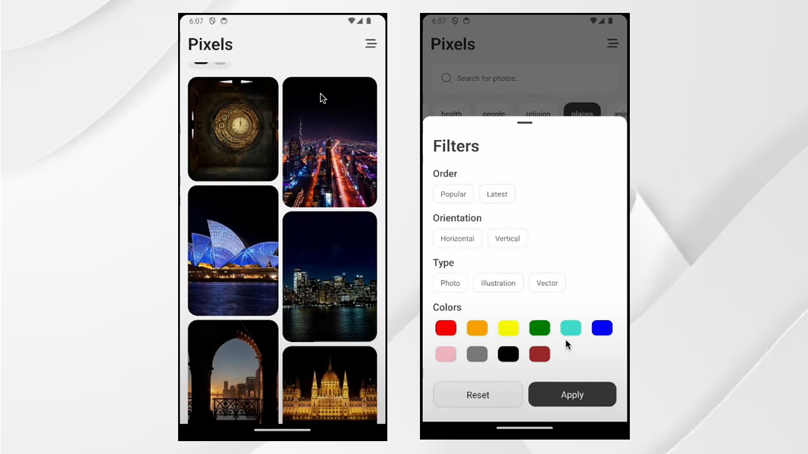

# Pixelverse

## Introduction 🌟🌟

Pixelverse is a wallpaper app designed with React Native to offer an engaging and fluid user experience. Utilizing the Pixabay API, Pixelverse provides access to a vast collection of stunning images. The app features seamless browsing, robust search capabilities, and intuitive navigation, making it easy to find and set your perfect wallpaper.

## Tech Stack ⚙️⚙️

- React Native
- Expo
- Expo Router
- Nativewind
- Pixabay API
- Linear Gradients
- Expo Vector Icons

Pixelverse also features a well-structured code architecture and reusable components to ensure maintainability and scalability.

### Author
- Linkedin - @aous-shaheen-381636221
- Facebook - @aoushaheen7

By me 🚀🚀🚀 Aous Shaheen ...